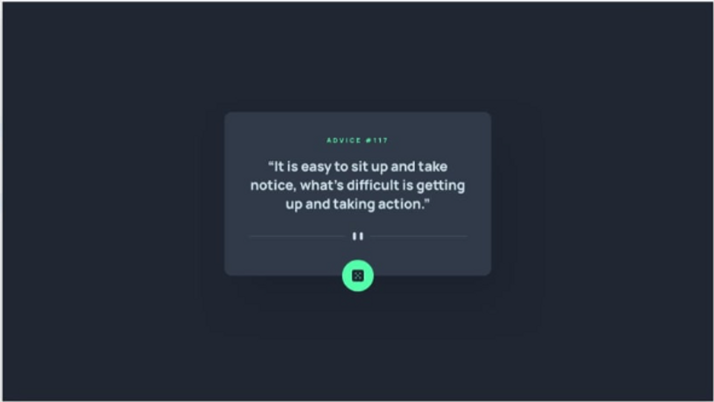
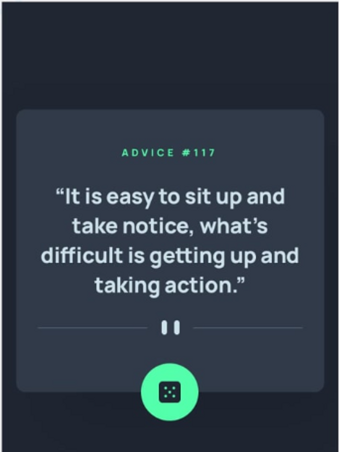

# App Gerador de conselhos- Sem Javascript
Seguindo com desafios do Frontend mentor, nível: Newbie, aliado ao curso do DevQuest, temos o layout de um app gerador de conselhos. Projeto à ser finalizado posteriormente com Javascript.

## Tecnologias utilizadas
- HMTL
- CSS

## Layout Desktop:
Layout esperad no Desktop, retirado do Frontend Mentor, com dados fictícios.

## Layout Mobile:
Exemplo do Layout esperado no Mobile, retirado do Frontend Mentor, com dados fictícios.

## Serviços usados
- VSCode
- GitHub
- GitHub Pages

## Funcionalidades
Por enquanto apenas o Layout do que será finalizado com o Javascript. Botão do dado já possui animação no hover, mas ainda não faz nada. Todo texto é fictício.

## Links
- GitPages: https://ricardovcastilho.github.io/Advice-Generator-app/
- Link do repositório: https://github.com/RicardoVCastilho/Advice-Generator-app

## Autor
Ricardo Vitor Castilho.